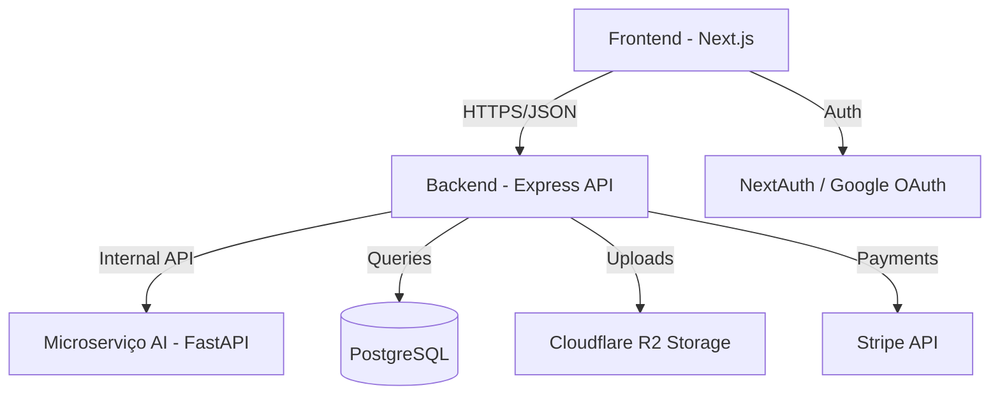

# 🦅 BentiFiles V2

**Plataforma SaaS de Gestão, Validação Inteligente e Armazenamento de Documentos.**

O **BentiFiles** é uma solução completa para empresas e profissionais que precisam coletar, organizar e validar documentos de terceiros. O sistema automatiza o processo de "verificação de qualidade" usando Inteligência Artificial (Visão Computacional) para garantir que os documentos enviados estejam legíveis, bem iluminados e contenham as informações necessárias, reduzindo drasticamente o esforço manual de revisão.

---

## 🏗️ Arquitetura do Sistema

O sistema é dividido em três camadas desacopladas que se comunicam via APIs REST:



1.  **Frontend (`/frontend`)**: Interface web moderna construída com Next.js 16, focada em UX premium e performance.
2.  **Backend (`/backend`)**: API robusta em Node.js que gerencia a lógica de negócio, permissões, pagamentos e integração com storage.
3.  **AI Microservice (`/microservice`)**: Motor de processamento de imagem em Python que realiza análise técnica de documentos em tempo real.

---

## ✨ Funcionalidades Principais

### 1. Gestão de Projetos e Colaboração
- **Criação de Projetos**: Organize coletas de documentos por clientes ou departamentos.
- **Sistema de Invites**: Gere links de convite para que usuários externos entrem em projetos específicos.
- **RBAC (Role-Based Access Control)**:
    - **ADMIN**: Pode gerenciar o projeto, solicitar documentos e aprovar/rejeitar envios.
    - **USER**: Pode visualizar as solicitações e realizar o upload dos documentos.

### 2. Validação Inteligente (IA)
Cada imagem enviada passa por um fluxo de processamento de alto nível:
1.  **Detecção de ROI**: Localiza o documento na imagem e aplica correção de perspectiva (**Warp Perspective**).
2.  **Métricas de Qualidade**:
    -   **Blur (Nitidez)**: Cálculo de variância do Laplaciano para detectar desfoque.
    -   **Brightness & Contrast**: Análise de média e desvio padrão da intensidade de pixels.
    -   **Glare Detection**: Identifica reflexos excessivos que podem ocultar informações.
    -   **Text Presence Score**: Uso de filtros de Sobel e análise Morfológica para detectar blocos de texto.
    -   **Perspective & Crop**: Avalia se o documento está cortado ou com inclinação excessiva.
3.  **Feedback Instantâneo**: Se o documento não atingir o score mínimo (0.71), o upload é bloqueado com o motivo técnico (ex: "imagem desfocada").

### 3. Fluxo de Revisão Humana
- **Dashboard de Pendências**: Administradores visualizam todos os documentos enviados.
- **Aprovação/Rejeição**: Fluxo formal de aprovação. Em caso de rejeição, o sistema solicita um novo envio automaticamente notificando o usuário.
- **Histórico Completo**: Log de quem enviou, quando foi analisado pela IA e quem foi o revisor humano.

### 4. Gestão Financeira (Stripe)
- **Assinaturas Recorrentes**: Mensal e Anual.
- **Entitlements**: Controle de acesso baseado no status da assinatura (`ACTIVE`, `TRIALING`, etc).
- **Checkout Dinâmico**: Seleção de quantidade customizada para planos corporativos.

---

## 📊 Estrutura de Dados (Prisma)

As principais entidades e seus relacionamentos:
-   **User**: Armazena dados de perfil, credenciais e metadados de assinatura do Stripe.
-   **Project**: O container principal onde a colaboração ocorre.
-   **ProjectMembership**: Tabela de junção que define o papel (`ADMIN`/`USER`) de um usuário em um projeto.
-   **File**: Registro de cada arquivo carregado, vinculado ao Cloudflare R2.
-   **ClientDocument**: Representa o documento solicitado. Vincula um usuário dono, o arquivo enviado e o status de revisão.
-   **VerificationResult**: Logs detalhados de cada análise feita pela IA para cada arquivo.
-   **DocumentType**: Define quais documentos podem ser solicitados (RG, CNH, Contrato, etc).

---

## 🛠️ Stack Tecnológica Detalhada

### 💻 Frontend
- **Framework**: Next.js 16 (App Router)
- **Linguagem**: TypeScript
- **Estilização**: SCSS Modules + Design System Baseado em Tokens
- **Autenticação**: NextAuth.js v5 (Google & Credentials)
- **UI Components**: Lucide React, Sonner (Toasts), Radix UI.

### ⚙️ Backend
- **Ambiente**: Node.js + Express
- **Linguagem**: TypeScript
- **ORM**: Prisma
- **Banco de Dados**: PostgreSQL (Supabase)
- **Segurança**: JWT, Bcrypt, Helmet, Cloudflare Turnstile.
- **Comunicação**: Axios, Nodemailer (SMTP Hostinger).

### 🤖 IA & Visão Computacional
- **Framework**: FastAPI (Python 3.10+)
- **Processamento**: OpenCV, NumPy, Pillow.
- **OCR**: Pytesseract & EasyOCR.
- **Modelagem**: Pydantic para validação de esquemas de dados.

---

## 📂 Estrutura do Projeto

```text
Bentifiles-V2/
├── backend/             # API Node.js (Express + Prisma)
│   ├── prisma/          # Modelagem do banco e Migrations
│   └── src/             # Código fonte da API
├── frontend/            # Aplicação Next.js
│   ├── public/          # Assets estáticos
│   └── src/app          # App Router (Páginas e Components)
├── microservice/        # Motor de IA em Python
│   ├── app/             # Lógica de análise de imagem
│   └── main.py          # Entrypoint FastAPI
└── docker-compose.yml   # Orquestração completa do sistema
```

---

## 🚀 Como Executar o Projeto

> [!IMPORTANT]
> Certifique-se de ter o **Node.js 20+**, **Python 3.10+** e **Docker** instalados.

### 1. Configuração de Variáveis de Ambiente
Você deve configurar os arquivos `.env` em cada diretório baseando-se nos exemplos:

**Backend (`/backend/.env`):**
```env
DATABASE_URL="postgresql://..."
JWT_SECRET="sua_chave"
STRIPE_SECRET_KEY="sk_test_..."
R2_ACCESS_KEY_ID="..."
R2_SECRET_ACCESS_KEY="..."
```

**Frontend (`/frontend/.env.local`):**
```env
NEXT_PUBLIC_API_URL="http://localhost:4000"
AUTH_GOOGLE_ID="..."
AUTH_GOOGLE_SECRET="..."
```

### 2. Execução via Docker (Recomendado)
Para rodar todo o ecossistema (Frontend, Backend e IA) de uma vez:
```bash
docker-compose up --build
```

### 3. Execução Manual (Desenvolvimento)

**Backend:**
```bash
cd backend && npm install
npx prisma generate
npm run dev
```

**Frontend:**
```bash
cd frontend && npm install
npm run dev
```

**Microserviço AI:**
```bash
cd microservice
python -m venv venv
source venv/bin/activate # Ou .\venv\Scripts\activate no Windows
pip install -r requirements.txt
uvicorn main:app --reload
```

---

## 🔒 Segurança e Infraestrutura
- **Storage**: Cloudflare R2 para armazenamento persistente de documentos.
- **Database**: PostgreSQL hospedado via Supabase para alta disponibilidade.
- **Proteção**: Rate limiting em rotas críticas e integração com Cloudflare Turnstile para prevenção de bots.

---

## 📝 Licença

Propriedade de **Sil-fiTech/Bentifiles**. Todos os direitos reservados.
