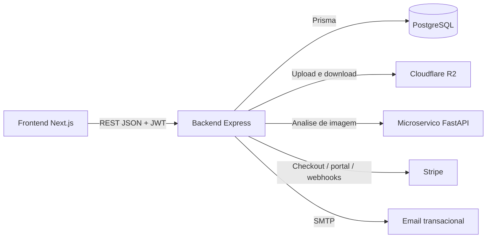
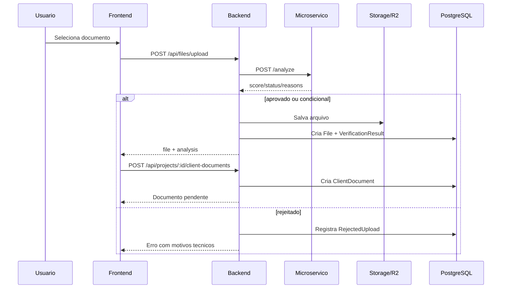

# BentiFiles V2: Arquitetura e Jornada do Usuario

## 1. Visao geral

O BentiFiles e uma plataforma SaaS para coleta, validacao, revisao e armazenamento de documentos. A solucao e composta por tres camadas principais:

## 2. Blocos do sistema

### Frontend
- Responsavel pelas jornadas de login, dashboard, projetos, upload, revisao e assinatura.
- Usa `localStorage` e `NextAuth` para sessao.
- Consulta o backend por REST.

### Backend
- Centraliza autenticacao, autorizacao, projetos, documentos, faturamento e integracoes.
- Protege rotas com JWT e middlewares de permissao.
- Faz upload para o R2 e chama o microservico para validar imagens.

### Microservico
- Analisa qualidade de imagens em `/analyze`.
- Converte imagens e DOCX para PDF em `/convert-to-pdf`.
- E interno ao ecossistema, consumido pelo backend.

## 3. Entidades principais

- `User`: conta do sistema, autenticacao, verificacao de email, assinatura e acesso.
- `Subscription`: assinatura dona do plano, especialmente para OFFICE.
- `SubscriptionSeatMember`: ocupacao de vagas da assinatura OFFICE.
- `Project`: espaco de trabalho principal.
- `ProjectMembership`: relacao usuario x projeto com papel `ADMIN` ou `USER`.
- `ProjectInvite`: convite para entrada em projeto.
- `DocumentType`: tipo de documento global ou customizado do tenant.
- `ProjectRequiredDocument`: configuracao de quais documentos um projeto exige.
- `File`: arquivo armazenado no R2.
- `VerificationResult`: resultado tecnico da IA para um arquivo.
- `ClientDocument`: vinculo de um arquivo a um documento exigido, dono, uploader e status humano.
- `Template`: conjunto reaproveitavel de documentos exigidos.

## 4. Regras de acesso

### Autenticacao
- Login por credenciais.
- Login social via Google.
- JWT emitido pelo backend.
- Verificacao de email obrigatoria no login por senha.

### Middlewares principais
- `authenticateToken`: exige JWT valido.
- `requireProductAccess`: exige acesso ao produto.
- `requireActiveSubscription`: exige assinatura ativa para criar projeto.
- `checkRole`: valida o papel do usuario dentro do projeto.
- `checkProjectNotArchived`: impede mutacoes em projeto arquivado.

### Perfis de uso
- Visitante: pode acessar landing, login, planos e verificacao de email.
- Usuario autenticado sem assinatura: consegue autenticar e consultar acesso, mas encontra limitacoes para criar projetos.
- Admin de projeto: configura documentos, convida membros, revisa e decide status.
- User de projeto: envia os proprios documentos e acompanha status.
- Dono de assinatura OFFICE: gerencia vagas e convites da assinatura.
- Membro OFFICE: usa acesso herdado da assinatura dona.

## 5. Jornada do usuario

## 5.1 Entrada e autenticacao

1. O usuario chega pela landing ou por um link de convite.
2. Se nao tiver conta, faz cadastro em `/login?mode=register`.
3. O frontend envia cadastro para `POST /api/users/register`.
4. O backend valida Turnstile, regra de senha e unicidade de email.
5. O usuario recebe email de verificacao.
6. Ao clicar no link, o frontend chama `GET /api/users/verify-email`.
7. Se o link tiver `invite` ou `officeInvite`, a verificacao ja tenta aceitar o convite.
8. Depois disso, o usuario entra no dashboard.

## 5.2 Recuperacao de senha

1. O usuario abre o modo "esqueci minha senha".
2. O frontend chama `POST /api/users/forgot-password`.
3. O backend gera token temporario e envia email.
4. O usuario redefine a senha com `POST /api/users/reset-password`.

## 5.3 Descoberta de acesso e assinatura

1. Ao entrar em rotas protegidas, o frontend consulta `GET /api/billing/access-status`.
2. Se o usuario nao tiver acesso, a experiencia o empurra para `/plans`.
3. Ao contratar, o frontend chama `POST /api/billing/create-checkout-session`.
4. O Stripe conclui o checkout.
5. O webhook `POST /webhooks/stripe` sincroniza assinatura.
6. O frontend pode forcar sincronizacao com `POST /api/billing/sync-subscription`.

## 5.4 Criacao do projeto

1. Usuario com acesso ativo cria projeto no dashboard.
2. O frontend chama `POST /api/projects`.
3. O backend cria o projeto e o primeiro `ProjectMembership` como `ADMIN`.
4. Opcionalmente aplica um template inicial no ato da criacao.

## 5.5 Configuracao do projeto

1. O admin abre configuracoes do projeto.
2. Busca tipos globais em `GET /api/documents/types`.
3. Lista templates em `GET /api/templates`.
4. Define documentos obrigatorios com `POST /api/projects/:id/required-documents`.
5. Ou aplica um template pronto com `POST /api/projects/:id/apply-template`.

## 5.6 Convite para membros ou clientes

### Convite de projeto
1. O admin gera convite com `POST /api/projects/:id/invites`.
2. Pode copiar o link ou disparar email com `POST /api/projects/:id/invites/:inviteId/email`.
3. O convidado chega ao login com `?invite=token`.
4. Depois de autenticado, o frontend chama `POST /api/projects/join`.

### Convite OFFICE
1. O dono da assinatura cria convite com `POST /api/billing/subscription/invites`.
2. O convidado recebe link com `officeInvite`.
3. A aceitacao ocorre em `POST /api/billing/subscription/invites/accept` ou durante a verificacao de email.

## 5.7 Upload e validacao automatica

1. O usuario entra no projeto e escolhe um documento obrigatorio.
2. O frontend envia o binario para `POST /api/files/upload`.
3. Se for imagem, o backend chama o microservico em `POST /analyze`.
4. Se a imagem falhar, o upload e barrado e um `RejectedUpload` e registrado.
5. Se passar, o arquivo e salvo no R2 e um `File` e criado.
6. O backend grava `VerificationResult`.
7. O frontend vincula o arquivo ao documento exigido via `POST /api/projects/:id/client-documents`.

## 5.8 Revisao humana

1. O admin visualiza pendencias no dashboard e no detalhe do projeto.
2. Os `ClientDocument` com status `pending` ficam aguardando decisao.
3. O admin aprova ou rejeita com `PATCH /api/documents/:docId/status`.
4. Em caso de rejeicao, o motivo pode ser registrado.
5. O usuario reenfileira o documento fazendo novo upload.

## 5.9 Consulta e download

1. O usuario lista seus arquivos em `GET /api/files`.
2. Visualiza conteudo em base64 por `GET /api/files/base64`.
3. Pode baixar lote do projeto por `GET /api/files/project/:projectId/base64`.
4. Quando necessario, o backend converte imagem ou DOCX para PDF usando o microservico.

## 5.10 Encerramento e manutencao

### Projeto
- `PATCH /api/projects/:id/archive`: arquiva.
- `PATCH /api/projects/:id/unarchive`: reativa.
- `DELETE /api/projects/:id`: exclusao logica.

### Assinatura
- `POST /api/billing/cancel-subscription`: agenda cancelamento.
- `POST /api/billing/reactivate-subscription`: reativa.
- `POST /api/billing/create-portal-session`: abre portal do Stripe.

## 6. Fluxo operacional resumido

## 7. Catalogo de endpoints

## 7.1 Saude

| Metodo | Endpoint | Uso |
|---|---|---|
| GET | `/health` | Healthcheck do backend |
| GET | `/health` no microservico | Healthcheck interno |

## 7.2 Autenticacao e conta

| Metodo | Endpoint | Auth | Uso |
|---|---|---|---|
| POST | `/api/users/register` | Nao | Cadastro |
| POST | `/api/users/login` | Nao | Login por senha |
| POST | `/api/users/forgot-password` | Nao | Solicitar reset |
| POST | `/api/users/reset-password` | Nao | Redefinir senha |
| GET | `/api/users/verify-email` | Nao | Confirmar email |
| POST | `/api/users/resend-verification` | Nao | Reenviar confirmacao |
| GET | `/api/users/me` | Sim | Perfil atual |
| PUT | `/api/users/me` | Sim | Atualizar perfil |
| POST | `/api/auth/google` | Nao | Login Google |

## 7.3 Projetos e membros

| Metodo | Endpoint | Auth | Uso |
|---|---|---|---|
| GET | `/api/projects` | Sim | Listar projetos do usuario |
| POST | `/api/projects` | Sim | Criar projeto |
| POST | `/api/projects/join` | Sim | Entrar por convite |
| PATCH | `/api/projects/:id` | Sim | Renomear projeto |
| PATCH | `/api/projects/:id/archive` | Sim | Arquivar |
| PATCH | `/api/projects/:id/unarchive` | Sim | Desarquivar |
| DELETE | `/api/projects/:id` | Sim | Excluir logicamente |
| GET | `/api/projects/:id/details` | Sim | Visao consolidada do projeto |
| GET | `/api/projects/:id/documents` | Sim | Arquivos do projeto |
| GET | `/api/projects/:id/members` | Sim | Membros |
| PATCH | `/api/projects/:id/members/:userId` | Sim | Alterar papel |
| DELETE | `/api/projects/:id/members/:userId` | Sim | Remover membro |
| POST | `/api/projects/:id/invites` | Sim | Criar convite |
| GET | `/api/projects/:id/invites` | Sim | Listar convites |
| POST | `/api/projects/:id/invites/:inviteId/email` | Sim | Enviar convite por email |

## 7.4 Documentos e arquivos

| Metodo | Endpoint | Auth | Uso |
|---|---|---|---|
| GET | `/api/documents/types` | Sim | Tipos globais/customizados |
| POST | `/api/documents/types` | Sim | Criar tipo |
| PUT | `/api/documents/types/:id` | Sim | Atualizar tipo |
| DELETE | `/api/documents/types/:id` | Sim | Remover tipo |
| GET | `/api/projects/:id/required-documents` | Sim | Tipos exigidos do projeto |
| POST | `/api/projects/:id/required-documents` | Sim | Configurar exigencias |
| GET | `/api/projects/:id/client-documents` | Sim | Listar documentos do projeto |
| POST | `/api/projects/:id/client-documents` | Sim | Vincular upload ao documento |
| PATCH | `/api/documents/:docId/status` | Sim | Aprovar/rejeitar |
| POST | `/api/files/upload` | Sim | Upload com validacao |
| GET | `/api/files` | Sim | Listar arquivos do usuario |
| GET | `/api/files/base64` | Sim | Visualizar ou baixar 1 arquivo |
| GET | `/api/files/project/:projectId/base64` | Sim | Exportar arquivos do projeto |
| GET | `/api/files/stats` | Sim | Indicadores do dashboard |
| GET | `/api/files/pending` | Sim | Pendencias para revisao |

## 7.5 Templates

| Metodo | Endpoint | Auth | Uso |
|---|---|---|---|
| GET | `/api/templates` | Sim | Listar templates |
| POST | `/api/templates` | Sim | Criar template |
| GET | `/api/templates/:id` | Sim | Detalhar template |
| PUT | `/api/templates/:id` | Sim | Atualizar template |
| DELETE | `/api/templates/:id` | Sim | Remover template |
| POST | `/api/templates/:id/duplicate` | Sim | Duplicar template |
| POST | `/api/projects/:id/apply-template` | Sim | Aplicar template ao projeto |

## 7.6 Billing

| Metodo | Endpoint | Auth | Uso |
|---|---|---|---|
| GET | `/api/billing/access-status` | Sim | Status de acesso |
| GET | `/api/billing/subscription` | Sim | Resumo da assinatura |
| POST | `/api/billing/create-checkout-session` | Sim | Iniciar checkout Stripe |
| POST | `/api/billing/create-portal-session` | Sim | Abrir portal Stripe |
| POST | `/api/billing/sync-subscription` | Sim | Sincronizar assinatura |
| POST | `/api/billing/cancel-subscription` | Sim | Cancelar ao fim do ciclo |
| POST | `/api/billing/reactivate-subscription` | Sim | Reativar assinatura |
| GET | `/api/billing/subscription/office` | Sim | Gestao OFFICE |
| POST | `/api/billing/subscription/invites` | Sim | Criar convite OFFICE |
| GET | `/api/billing/subscription/invites` | Sim | Listar convites OFFICE |
| POST | `/api/billing/subscription/invites/accept` | Sim | Aceitar convite OFFICE |
| DELETE | `/api/billing/subscription/invites/:id` | Sim | Revogar convite OFFICE |
| DELETE | `/api/billing/subscription/members/:id` | Sim | Remover membro OFFICE |

## 7.7 Integracoes internas

| Metodo | Endpoint | Uso |
|---|---|---|
| POST | `/webhooks/stripe` | Atualizacao de assinatura por webhook |
| POST | `/analyze` | Analise de legibilidade e qualidade |
| POST | `/convert-to-pdf` | Conversao para PDF |

## 8. Pontos de atencao arquiteturais

- O sistema separa validacao tecnica da validacao humana; isso e bom para escalabilidade.
- `File` e `ClientDocument` tem responsabilidades diferentes: armazenamento versus workflow.
- Projetos arquivados entram em modo protegido por middleware para evitar alteracoes indevidas.
- O acesso ao produto e diferente do acesso ao projeto; isso aparece em `requireProductAccess` e `checkRole`.
- O fluxo de convite esta bem integrado com verificacao de email, reduzindo friccao de onboarding.

## 9. Artefato Swagger/OpenAPI

Foi criado um arquivo OpenAPI inicial em:

- `docs/openapi.yaml`

Esse arquivo cobre os endpoints principais do backend e pode ser aberto diretamente no Swagger Editor ou servir de base para expor Swagger UI no proprio backend depois.
